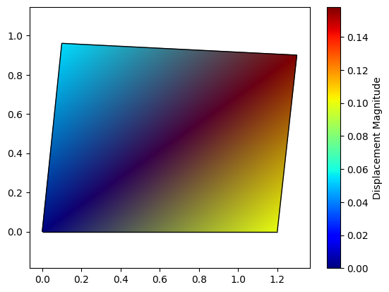

# MechanicsKit

`mechanicskit` is a Python toolkit designed for engineering education, particularly in mechanics and finite element analysis. It provides a suite of tools to bridge the gap between mathematical notation commonly found in textbooks and computational implementation in Python. The goal is to reduce the cognitive overhead of programming syntax, allowing students to focus on the mechanical principles themselves.

The library's core capabilities include:
- A LaTeX rendering pipeline for NumPy and SymPy objects in both Marimo and Jupyter notebooks.
- A pedagogical `Mesh` class for finite element method (FEM) education that uses 1-based indexing to align with standard textbook notation.
- A MATLAB-style `patch` function for advanced visualization of FEM meshes and results.

## Installation

Install the package directly from GitHub using `pip`:
```bash
pip install git+https://github.com/cenmir/mechanicskit.git
```
For development, clone the repository and install it in editable mode:
```bash
uv pip install -e .
```

## Core Capabilities

### LaTeX Display for NumPy and SymPy

A common challenge in computational mechanics is inspecting matrices and vectors. The default print output is often difficult to read and does not match the clear typesetting of academic texts. `mechanicskit` provides a simple display mechanism to render these objects as LaTeX.

#### Usage

The recommended use is via the pipe operator `|`, which provides an intuitive, opt-in mechanism for rendering.

```python
import numpy as np
from mechanicskit import la

# Render a simple vector
np.array([1, 2, 3]) | la

# Works with expressions
A = np.array([[1, 2], [3, 4]])
B = np.array([[5, 6], [7, 8]])
(A @ B) | la
```

```math
\begin{bmatrix}
19 & 22 \\
43 & 50 
\end{bmatrix}
```

The renderer intelligently truncates large arrays to maintain readability.

#### Example LaTeX Output

Vectors with five or fewer elements are displayed as column vectors:

```math
\begin{bmatrix}
1 \\
2 \\
3
\end{bmatrix}
```

While larger matrices are automatically truncated with ellipsis notation:

```math
\begin{bmatrix}
1 & 2 & 3 & \cdots & 10 \\
11 & 12 & 13 & \cdots & 20 \\
\vdots & \vdots & \vdots & \ddots & \vdots \\
91 & 92 & 93 & \cdots & 100
\end{bmatrix}
```

#### The display_labeled_latex() function

For Jupyter environments, the `display_labeled_latex` function offers a way to present expressions with formatted labels, which is useful for creating clear, readable examples in educational notebooks.

```python
from mechanicskit import display_labeled_latex
from sympy import symbols, cos, sin, Matrix

theta = symbols('theta')
R = Matrix([
    [cos(theta), -sin(theta)],
    [sin(theta),  cos(theta)]
])

# Renders SymPy matrices with proper symbolic notation
display_labeled_latex(r"\mathbf{R}(\theta) = ", R)
```

```math
\mathbf{R}(\theta) = \begin{bmatrix}
\cos{\left(\theta \right)} & - \sin{\left(\theta \right)} \\
\sin{\left(\theta \right)} & \cos{\left(\theta \right)}
\end{bmatrix}
```


### Pedagogical FEM Mesh Tools

In finite element literature, nodes and connectivity are typically described using 1-based indexing. This creates a persistent conflict with Python's 0-based indexing, forcing students to perform mental translations that distract from the core FEM concepts.

The `Mesh` class addresses this by providing an element-agnostic data structure that uses natural, 1-based indexing for all user-facing interactions.

```python
from mechanicskit import Mesh

# Define mesh using natural 1-based notation
coords = [[0, 0], [1, 0], [0, 1], [1, 1]]
connectivity = [[1, 2], [1, 3], [2, 3], [2, 4], [3, 4]]  # 1-based

mesh = Mesh(coords, connectivity, element_type='ROD')

# Access node 3 directly (not index 2)
coord = mesh.get_node(3)
print(f"Coordinates of node 3: {coord}")

# Get DOF indices for assembly
# Returns [4, 5] for a 2D ROD element
dofs = mesh.dofs_for_node(3)
print(f"DOFs for node 3: {dofs}")

ele = mesh.get_element(2)
print(f"Element 2 connectivity (1-based): {ele[0]}")
```

```
Coordinates of node 3: [0. 1.]
DOFs for node 3: [4 5]
Element 2 connectivity (1-based): [1 3]
```

This approach reduces cognitive load and allows the code to more closely mirror textbook formulations. The mesh supports a variety of standard element types (e.g., `ROD`, `BEAM`, `TRIA3`, `QUAD4`).

### Easy Visualization

The library includes a `patch()` function, inspired by MATLAB's versatile patch visualization capabilities. It is designed for visualizing FEM meshes and plotting scalar or vector field data on them. It uses a "Faces/Vertices" notation and supports 1-based indexing for connectivity data.

Key functionalities include per-vertex color interpolation for smooth gradients, per-element flat colors, and support for various line and surface element types in 2D and 3D.


```python
import numpy as np
from mechanicskit import patch
import matplotlib.pyplot as plt

# Deformed mesh with color-coded displacement magnitude
P = np.array([[0, 0], [1, 0], [1, 1], [0, 1]])
faces = np.array([[1, 2, 3, 4]])
U = np.array([[0, 0], [0.1, 0], [0.15, -0.05], [0.05, -0.02]])
U_mag = np.sqrt(np.sum(U**2, axis=1))

fig, ax = plt.subplots()
P_deformed = P + U * 0.5 # Apply a scaling factor for visibility
patch('Faces', faces, 'Vertices', P_deformed,
      'FaceVertexCData', U_mag,
      'FaceColor', 'interp',
      'EdgeColor', 'black',
      'cmap', 'jet',
      ax=ax)
ax.axis('equal')
plt.colorbar(ax.collections[0], label='Displacement Magnitude')
plt.show()
```




The library also includes a `fplot()` function for plotting mathematical functions with SymPy expressions, providing a simple interface for visualizing functions in 1D.

```python
from mechanicskit import patch
import sympy as sp

x = sp.symbols('x')

plt.figure(figsize=(8, 5))
fplot(sp.exp(-x**2), range=(-3, 3), color='red', linewidth=2, label='Gaussian')
plt.xlabel('x')
plt.ylabel('y')
plt.grid(True, alpha=0.3)
plt.legend()
plt.show()
```


## Update History

**December 2025**
- Added `show_shape` parameter to display array dimensions as a subscript.
- Added `display_labeled_latex()` function for Jupyter notebooks with labeled equations.
- Implemented SymPy integration for automatic detection and proper symbolic formatting.
- Added `arrayStretch` parameter for customizable row spacing in matrices.
- Reorganized the repository structure to follow standard Python project layouts.
- Added a comprehensive test suite using pytest.
- Created example notebooks and detailed documentation.

## Testing
The project includes a suite of automated tests to ensure correctness and prevent regressions. To run the tests, install the test dependencies and execute pytest from the root directory.

```bash
# Install test dependencies
pip install pytest pytest-cov

# Run all tests
pytest
```